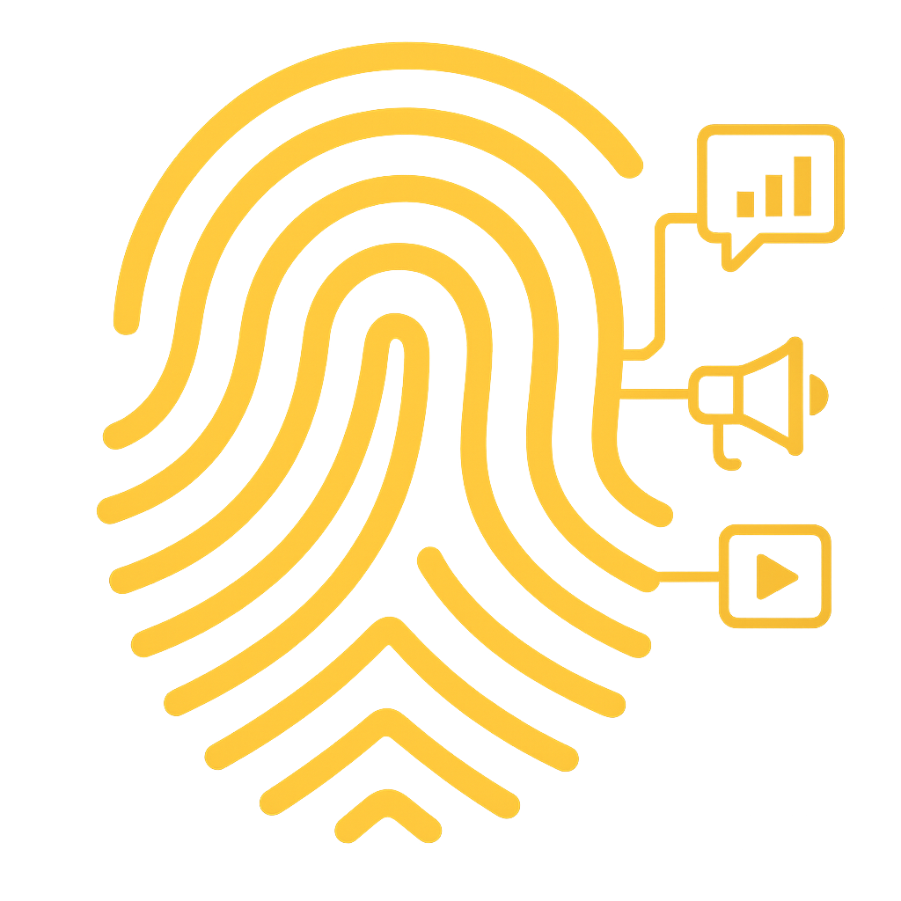

<!DOCTYPE html>
<html lang="ar" dir="rtl">
  <head>
    <meta charset="UTF-8" />
    <meta name="viewport" content="width=device-width, initial-scale=1.0" />
    <title>بصمة رقمية</title>
    
  </head>
  <body>
    
    <h1>بصمة رقمية</h1>
    <h2>لكل فكرة... بصمتها الرقمية</h2>
    
مرحباً بكم في شركتكم المتخصصة في التصميم والتسويق الرقمي.

    
نساعدكم في إبراز فكرتكم بأفضل صورة رقمية عبر تصاميم جذابة وتسويق فعّال.

    <a class="whatsapp" href="https://wa.me/967773971322" target="_blank">تواصل معنا عبر واتساب</a>
  </body>
</html>
